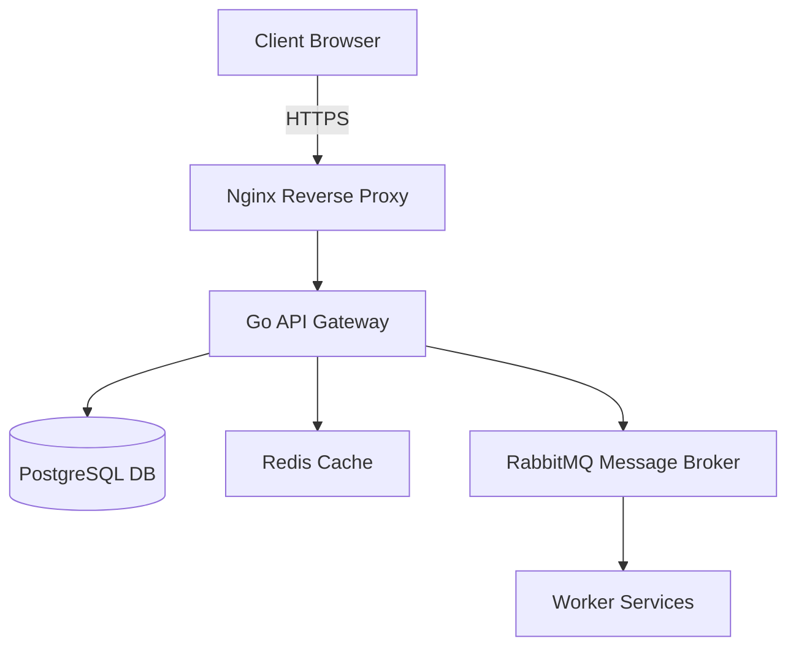

<div align="center">
  

# 🚀 Enterprise Project Name

<p align="center">
  A robust, high-performance solution engineered to solve complex production workflows at scale.
</p>

[](https://opensource.org)
[]()
[](http://makeapullrequest.com)

<p align="center">
  <a href="#-about-the-project">About</a> •
  <a href="#-key-features">Features</a> •
  <a href="#-architecture">Architecture</a> •
  <a href="#-getting-started">Getting Started</a> •
  <a href="#-configuration">Configuration</a> •
  <a href="#-deployment">Deployment</a> •
  <a href="#-roadmap">Roadmap</a>
</p>

  
</div>

---

## 📖 About The Project

This project provides a comprehensive infrastructure solution for modern cloud applications. It addresses critical bottlenecks in data processing, automates repetitive operational workflows, and scales horizontally to meet high-demand enterprise environments.

### 🛠️ Built With

* [Next.js](https://nextjs.org) - Frontend Framework
* [Go](https://go.dev) - Backend API Service
* [PostgreSQL](https://postgresql.org) - Primary Database
* [Docker](https://docker.com) - Containerization

---

## ✨ Key Features

* **High Throughput:** Processes over 10,000 requests per second with sub-millisecond latency.
* **Plug-and-Play Modules:** Modular architecture allows easy integration of custom plugins.
* **Enterprise Security:** Built-in RBAC (Role-Based Access Control) and OAuth2 integration.
* **Real-time Analytics:** Native dashboards for monitoring system health and data metrics.

---

## 🏗️ Architecture



---

## 🚀 Getting Started

### 📋 Prerequisites

Ensure you have the following software installed locally:
* Docker Desktop (v24.0 or higher)
* Node.js (v20 or higher)

### ⚙️ Installation & Setup

1. **Clone the repository**
   ```bash
   git clone https://github.com
   cd your-repo-name
   ```

2. **Environment configuration**
   ```bash
   cp .env.example .env
   ```

3. **Spin up microservices via Docker**
   ```bash
   docker-compose up -d
   ```

4. **Install frontend dependencies & start development server**
   ```bash
   cd apps/web && npm install && npm run dev
   ```

---

## 🔧 Configuration

The application reads configurations from environment variables listed in the `.env` file.

| Variable | Type | Default | Description |
| :--- | :--- | :--- | :--- |
| `PORT` | Number | `8080` | The port where the API server listens. |
| `DATABASE_URL` | String | `none` | Connection string for the PostgreSQL database. |
| `ENABLE_TELEMETRY`| Boolean| `true` | Toggles Prometheus/Grafana metric exports. |

---

## 🧪 Running Tests

### Unit Tests
```bash
npm run test:unit
```

### Integration & End-to-End Tests
```bash
npm run test:e2e
```

---

## 📦 Deployment

### Production Build
```bash
docker build -t enterprise-app:latest .
```

### Kubernetes Deployment
```bash
kubectl apply -f ./k8s/manifests/
```

---

## 🗺️ Roadmap

* [x] Core API implementation and database schema design
* [x] Real-time WebSocket notification engine
* [ ] Multi-tenant isolation architecture
* [ ] Native SDKs for Python and Java platforms

---

## 🤝 Contributing

We welcome community contributions to make this project better.

1. Fork the Project
2. Create your Feature Branch (`git checkout -b feature/AmazingFeature`)
3. Commit your Changes (`git commit -m 'Add some AmazingFeature'`)
4. Push to the Branch (`git push origin feature/AmazingFeature`)
5. Open a Pull Request

---

## 📄 License

Distributed under the MIT License. See `LICENSE` for more information.

---

## 👥 Authors & Contact

* **Lead Maintainer:** Alex Rivera - [@alex_rivera](https://twitter.com) - alex@example.com
* **Project Link:** [https://github.com](https://github.com)
